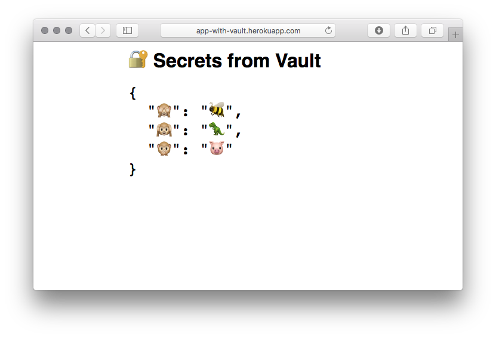

# Heroku app with Hashicorp Vault

A [Next.js Heroku app](https://github.com/mars/heroku-nextjs) to illustrate fetching secrets from [Hashicorp Vault](https://www.vaultproject.io) via [dyno-secret-fetcher](https://github.com/mars/dyno-secret-fetcher). Displays secrets in a web UI as a demo, not a real use-case.

## Example

After setting secrets in a [production Vault server](https://aws.amazon.com/quickstart/architecture/vault/):

```bash
vault write secret/app_secrets 🙈=🐝 🙉=🦖 🙊=🐷
```

…this app was deployed with the following config:

```bash
heroku create --space my-space
heroku buildpacks:add heroku/ruby
heroku buildpacks:add heroku/nodejs
heroku config:set \
  VAULT_ADDR=http://10.x.x.x:8200 \
  VAULT_TOKEN=xxxxxxxx-xxxx-xxxx-xxxx-xxxxxxxxxxx \
  VAULT_SECRETS_MOUNT=secret \
  VAULT_READ_PATHS=app_secrets
```

…and it successfully read from Vault, displaying the secrets:


